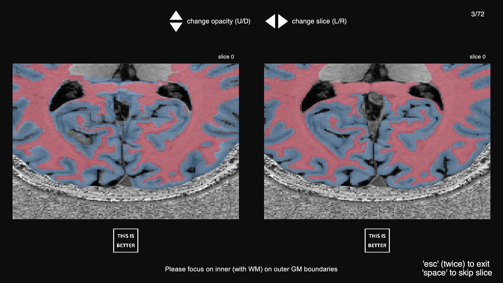

<p align="center">
  
</p>


<hr>
# Abstract

Ultra high-field MRI enables sub-millimetre resolution imaging of the human brain, allowing for the resolution of functional circuits at the meso-scale of cortical layers.
An essential step in many functional and structural neuroimaging studies is segmentation, the operation of partitioning the MR brain images to delineate anatomical structures.
Despite recent efforts in brain imaging analysis, the literature lacks of accurate and fast methods for segmenting 7 Tesla (7T) brain MRI.
We here present `CEREBRUM-7T`, an optimised end-to-end Convolutional Neural Network (CNN) architecture, that allows for the segmentation of a whole 7T T1w MRI brain volume at once, thus overcoming the drawbacks of partitioning the volume into 2D or 3D tiles. 
Training is performed in a weakly supervised fashion, exploiting labelling with errors obtained with automatic state-of-the-art methods. 
The trained model is able to produce accurate multi-structure segmentation masks on six different classes in only a few seconds. 
In the experimental part, a combination of objective numerical evaluations and subjective analysis carried out by experienced neuroimaging users, confirms that the proposed solution outperforms the training labels it was trained on in segmentation accuracy, and is suitable for neuroimaging studies, such as layer fMRI studies. 
Taking advantage of a fine-tuning operation on a reduced set of volumes, we also show how it is possible to efficiently and effectively apply `CEREBRUM-7T` to data from different sites.
Furthermore, to allow replicability and encourage extensions, we release the code, 7T data (142 volumes), and other materials, including the training labels and the Turing test.

<hr>
# Results

<!--
<p align="center">
  
</p> -->

In result pages, there are results of our method with data from two different sites and settings: - <a href="https://rocknroll87q.github.io/cerebrum7t/results_glasgow">Pag. 1</a> - training and testing on Glasgow data and - <a href="https://rocknroll87q.github.io/cerebrum7t/results_ahead">Pag. 2</a> - fine tuning experiment on AHEAD data.
We also push the limit of our method on a very challenging scenario at - <a href="https://rocknroll87q.github.io/cerebrum7t/results_Schneider19">Pag. 3</a>.


<hr>
# Pros and Cons

<table align="center" width="80%">
 <tr>
    <td><b style="font-size:30px"></b></td>
    <td><center><span style='font-size:100px;'>&#9989;</span></center></td>
    <td><center><span style='font-size:100px;'>&#10060;</span></center></td>
 </tr>
 <tr>
    <td><u style="font-size:16px">Timing</u></td>
    <td>Very fast inference: <code>~ 5/10</code> sec.</td>
    <td>Training needs <code>~ 24</code> hours</td>
 </tr>
 <tr>
    <td><u style="font-size:16px">Hardware</u></td>
    <td>Inference easily done on CPU</td>
    <td>Needs 4 GPUs for training</td>
 </tr>
 <tr>
    <td><u style="font-size:16px">Training labels</u></td>
    <td>Does not need accurate labels</td>
    <td>Does not overcome systematic errors</td>
 </tr>
 <tr>
    <td><u style="font-size:16px">Visual outcome</u></td>
    <td>Very clean and smooth segmentation</td>
    <td>Does not recover from "burn" artefacts</td>
 </tr>
 <tr>
    <td><u style="font-size:16px">New dataset</u></td>
    <td>Works very well but only if... &#8594;</td>
    <td>Needs fine-tuning</td>
 </tr>
 
</table>

<hr>
# Usage

Visit the relative [page](https://rocknroll87q.github.io/cerebrum7t/usage) to learn how to use `CEREBRUM-7T` from source code, docker, or singularity.

<hr>
# Data

Visit the relative [page](https://rocknroll87q.github.io/cerebrum7t/data) for all the information needed about the data.

<hr>
# Turing test

As we discussed in the paper, we designed and implemented a PsychoPy (Peirce et al., 2019) test for neuroscientists to assess the segmentation quality of CEREBRUM-7T comparing our model with manual segmentation and with the GT. In the figure below, we show the interface we presented the participants with.

<p align="center">
  
</p>

The source code to replicate the test is made available [here](https://github.com/rockNroll87q/segmentation_survey).

<hr>
# Citation

Svanera, M., Benini, S., Bontempi, D., & Muckli, L. (2020). CEREBRUM-7T: fast and fully-volumetric brain segmentation of out-of-the-scanner 7T MR volumes. bioRxiv.

```
@article {Svanera2020.07.07.191536,
	author = {Svanera, Michele and Bontempi, Dennis and Benini, Sergio and Muckli, Lars},
	title = {CEREBRUM-7T: fast and fully-volumetric brain segmentation of out-of-the-scanner 7T MR volumes},
	elocation-id = {2020.07.07.191536},
	year = {2020},
	doi = {10.1101/2020.07.07.191536},
	URL = {https://www.biorxiv.org/content/early/2020/07/08/2020.07.07.191536},
	eprint = {https://www.biorxiv.org/content/early/2020/07/08/2020.07.07.191536.full.pdf},
	journal = {bioRxiv}
}
```

<hr>
# Acknowledgments

This project has received funding from the European Union Horizon 2020 Framework Programme for Research and Innovation under the Specific Grant Agreement No. 785907 and 945539 (Human Brain Project SGA2 and SGA3).


<hr>

