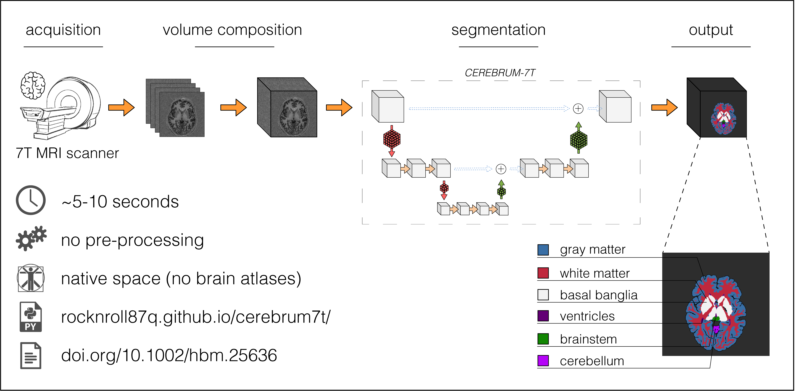

<hr>

<p align="center">
  
</p>

<hr>
# Results

<p align="center">

<kbd>
  
</kbd>

</p>

<hr>
# Abstract

Ultra high field MRI enables sub-millimetre resolution imaging of human brain, allowing to disentangle complex functional circuits across different cortical depths.
The capability of using these innovative scanners at 7 Tesla (7T) poses new challenges, as for example those related to the current lack of standardised acquisition protocols, and of automatised pipelines for image analysis.
Segmentation, meant as the partition of MR brain images in multiple anatomical classes, is an essential step in many functional and structural neuroimaging studies.
In this work, we design and test `CEREBRUM-7T`, an optimised end-to-end CNN architecture, that allows to segment a whole 7T T1_w MRI brain volume at once, without the need of partitioning it into 2D or 3D tiles.
Despite deep learning (DL) methods are recently starting to emerge in 3T literature, to the best of our knowledge, `CEREBRUM-7T` is the first example of DL architecture directly applied on 7T data with the purpose of segmentation.
Training is performed in a weakly supervised fashion, since it exploits a ground-truth (GT) not exempt from errors. 
The generated model is able to produce accurate multi-structure segmentation masks on six different classes, in only few seconds.
In the experimental part, a combination of objective numerical evaluations, and subjective analysis 
carried out by experienced neuroimaging users, confirms that the proposed solution outperforms the GT it was trained on in segmentation accuracy, and it is suitable for many neuroimaging studies.
Furthermore, to allow replicability and encourage extensions, we release the code, 7T data (145 volumes), and other materials, including the GT and the survey.


<hr>
# Citation

Svanera, M., Benini, S., Bontempi, D., & Muckli, L. (2020). CEREBRUM-7T: fast and fully-volumetric brain segmentation of out-of-the-scanner 7T MR volumes. bioRxiv.

```
@article {Svanera2020.07.07.191536,
	author = {Svanera, Michele and Bontempi, Dennis and Benini, Sergio and Muckli, Lars},
	title = {CEREBRUM-7T: fast and fully-volumetric brain segmentation of out-of-the-scanner 7T MR volumes},
	elocation-id = {2020.07.07.191536},
	year = {2020},
	doi = {10.1101/2020.07.07.191536},
	URL = {https://www.biorxiv.org/content/early/2020/07/08/2020.07.07.191536},
	eprint = {https://www.biorxiv.org/content/early/2020/07/08/2020.07.07.191536.full.pdf},
	journal = {bioRxiv}
}
```


