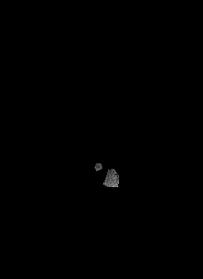

[<-- main page](https://rocknroll87q.github.io/cerebrum7t/)

# Results

In this page, there are results of our method with data from two different sites, both T1w: on Glasgow data and on AHEAD data.

## Glasgow

## AHEAD: a fine tuning experiment

In this experiment, we accomplish very good results using only 20 volumes to `fine tuning` the model (trained on Glasgow data) on AHEAD data  ([link](https://doi.org/10.1016/j.neuroimage.2020.117200)).
The labels used for training were described in the paper, while the labels for fine tunings derive from FreeSurfer v7.
Comparisons that you can see below are made against FreeSurfer v7 on the testing set.

As it is possible to see, FreeSurfer v7, which has been improved for UHF data, is able to segment very well multiple areas, but the inhomogeneity of the scan affects its ability to correctly select all the areas. It produces some "holes" in the segmeantation; please notice parietal and occipital lobes.
In addition, our method produces much smoother results.

But judge yourself! Download the segmentation masks for both methods [here](https://github.com/rockNroll87q/cerebrum7t/tree/gh-pages/results/AHEAD/seg_labels).

<!--  <tr>
    <td><b style="font-size:30px"></b>sub_0068</td>
    <td>

</td>
    <td>
  
</td>
 </tr>-->

<table align="center" cellspacing="0" cellpadding="0">
 <tr>
 	<td><b style="font-size:20px">Subject</b></td>
 	<td>
<b style="font-size:20px">FreeSurfer v7</b>
</td> 
 	<td>
<b style="font-size:20px">CEREBRUM 7T</b>
</td> 
 </tr>
 

 <tr>
    <td><b style="font-size:30px"></b>sub_0014</td>
    <td>

</td>
    <td>
  
</td>
 </tr>
 
 <tr>
    <td><b style="font-size:30px"></b>sub_0014</td>
    <td>

</td>
    <td>
  
</td>
 </tr>
 
  <tr>
    <td><b style="font-size:30px"></b>sub_0025</td>
    <td>

</td>
    <td>
  
</td>
 </tr>
 
  <tr>
    <td><b style="font-size:30px"></b>sub_0035</td>
    <td>

</td>
    <td>
  
</td>
 </tr>
 
  <tr>
    <td><b style="font-size:30px"></b>sub_0011</td>
    <td>

</td>
    <td>
  
</td>
 </tr>

  <tr>
    <td><b style="font-size:30px"></b>sub_0037</td>
    <td>

</td>
    <td>
  
</td>
 </tr>
 
  <tr>
    <td><b style="font-size:30px"></b>sub_0038</td>
    <td>

</td>
    <td>
  
</td>
 </tr>
 
  <tr>
    <td><b style="font-size:30px"></b>sub_0040</td>
    <td>

</td>
    <td>
  
</td>
 </tr>
 
  <tr>
    <td><b style="font-size:30px"></b>sub_0068</td>
    <td>

</td>
    <td>
  
</td>
 </tr>
 
  <tr>
    <td><b style="font-size:30px"></b>sub_0093</td>
    <td>

</td>
    <td>
  
</td>
 </tr>
</table>
