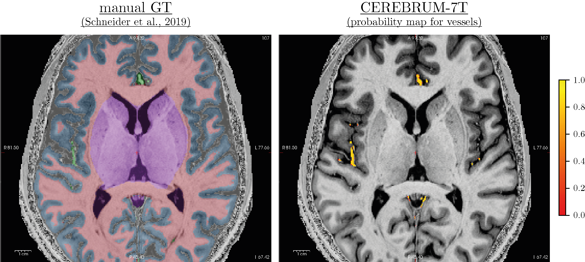
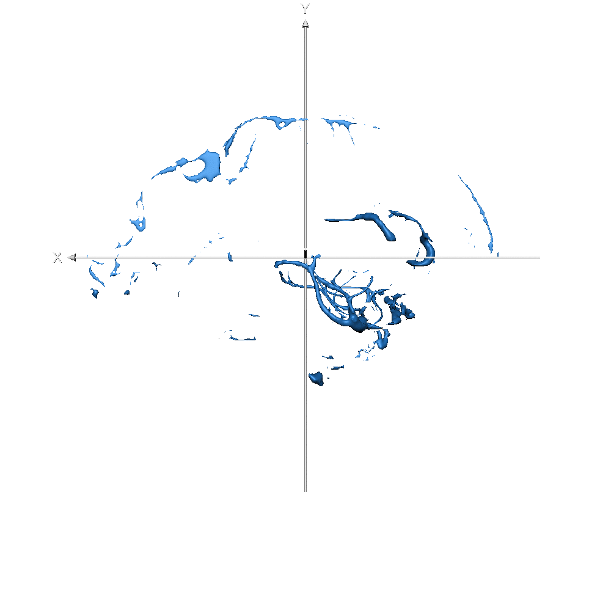

[<-- main page](https://rocknroll87q.github.io/cerebrum7t/)

# Schneider et al. 19: a fine tuning experiment on manual segmentation

In this experiment, we tried to push the limit of our method in this very challenging scenario. 
Using the [dataset](https://doi.org/10.5281/zenodo.3401388) below, we fine tuned the model (trained on Glasgow data) to replicate the manual segmentations provided by:

~~~
Marian Schneider, Faruk Omer Gulban, & Rainer Goebel. (2019).
Data set for sub-millimetre MRI tissue class segmentation (Version v1.0.0) 
[Data set]. Zenodo.
http://doi.org/10.5281/zenodo.3401388
~~~

The dataset has excellent manual segmentations, but only for 4 volumes of the `mp2rage` sequence (with the `mprage` sequence excluded for the moment).
We exploited a cross-validation strategy, using 3 volumes for training and 1 for testing.
Since the method needs a substantial training set, we applied a strong augmentation procedure, concatenating different volume manipulation strategies: translation, rotation, and morphing. 
Doing so, we created 30 volumes for each training sample (for a total of 90). 
Unfortunately, due to GPU memory limitations, we had to suppress the `sagittal sinus` label.
To easier the task, we applied a brain mask to the volume, cropping outside the skull.

Results show that, with only 3 volumes for fine-tuning, if the predicted labels are very accurate, the model provides great flexibility.
To analyse results, we need to distinguish them into two different groups.
In the first, we have the same classes as before, like GM, WM, and ventricles, or a combination of previous classes, like CSF or subcortical, which is a combination of basal ganglia, brainstem, and cerebellum.
On these classes, the model takes advantage of the previous learning (on Glasgow data) and simply transfers/applies the knowledge on the new dataset, leading to very good results.
In the second scenario, on classes never seen before, like vessels, the model has not a prior-knowledge and the segmentation results are qualitatively lower.
This was expected and results confirmed our original hypothesis.
Also here our method produces smooth segmentation masks.

In general, these results are very important because they directly tackle one of the main limitation of deep learning: the need for a big dataset.
However, it is pretty straightforward to say that in this scenario, safer strategies can be applied, like decomposing the volumes in slices and apply a slice-based method. 

For further inspections, yon can download the segmentation masks for both manual and our method [here](https://github.com/rockNroll87q/cerebrum7t/tree/gh-pages/results/Schneider19/seg_labels).

### Results

Figure 7-S (of the paper). Left - T1w with overlaid the manual ground truth of a testing volume of Schneider et al. (2019) data where the green label corresponds to "blood vessel". Right - Probability map obtained by CEREBRUM-7T for the blood vessel class. 

<table align="center" cellspacing="0" cellpadding="0">
 <tr>
 	<td><b style="font-size:20px">Subj ID</b></td>
 	<td>
<b style="font-size:20px">Manual</b>
</td> 
 	<td>
<b style="font-size:20px">CEREBRUM 7T</b>
</td> 
 </tr>
 
   <tr>
    <td><b style="font-size:30px"></b>sub-019 (WM only)</td>
    <td>

</td>
    <td>
  
</td>
 </tr>
 

 <tr>
    <td><b style="font-size:30px"></b>sub-019 (GM only)</td>
    <td>

</td>
    <td>
  
</td>
 </tr>

 <tr>
    <td><b style="font-size:30px"></b>sub-019 (vessels only)</td>
    <td>

</td>
    <td>
  
</td>
 </tr>
 
 </table>
