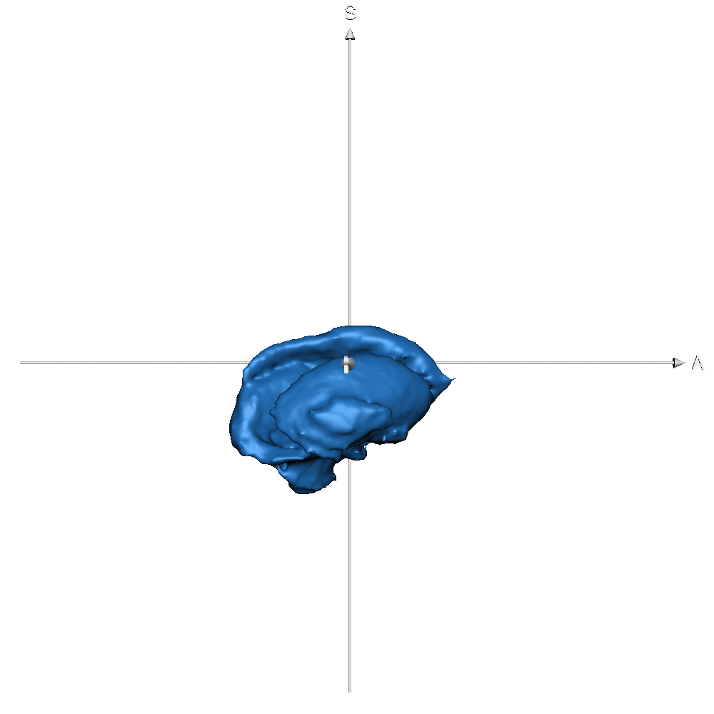
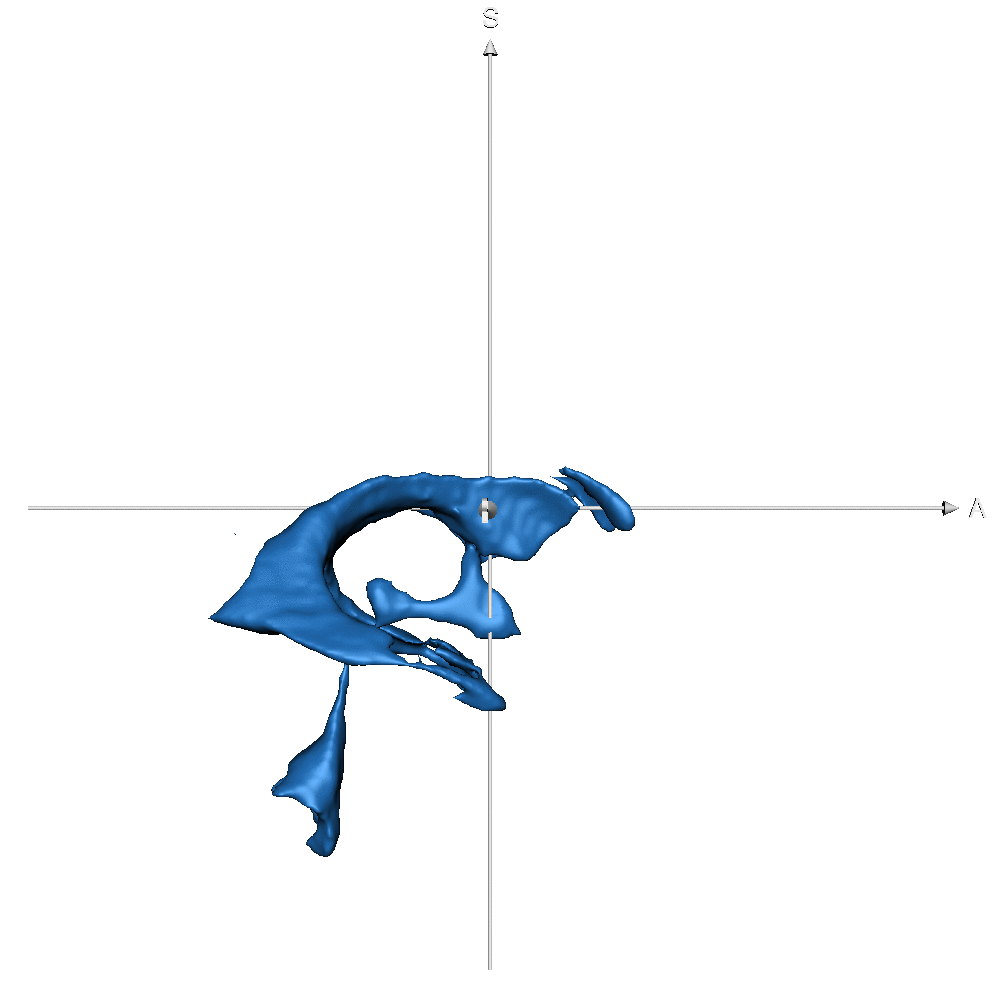
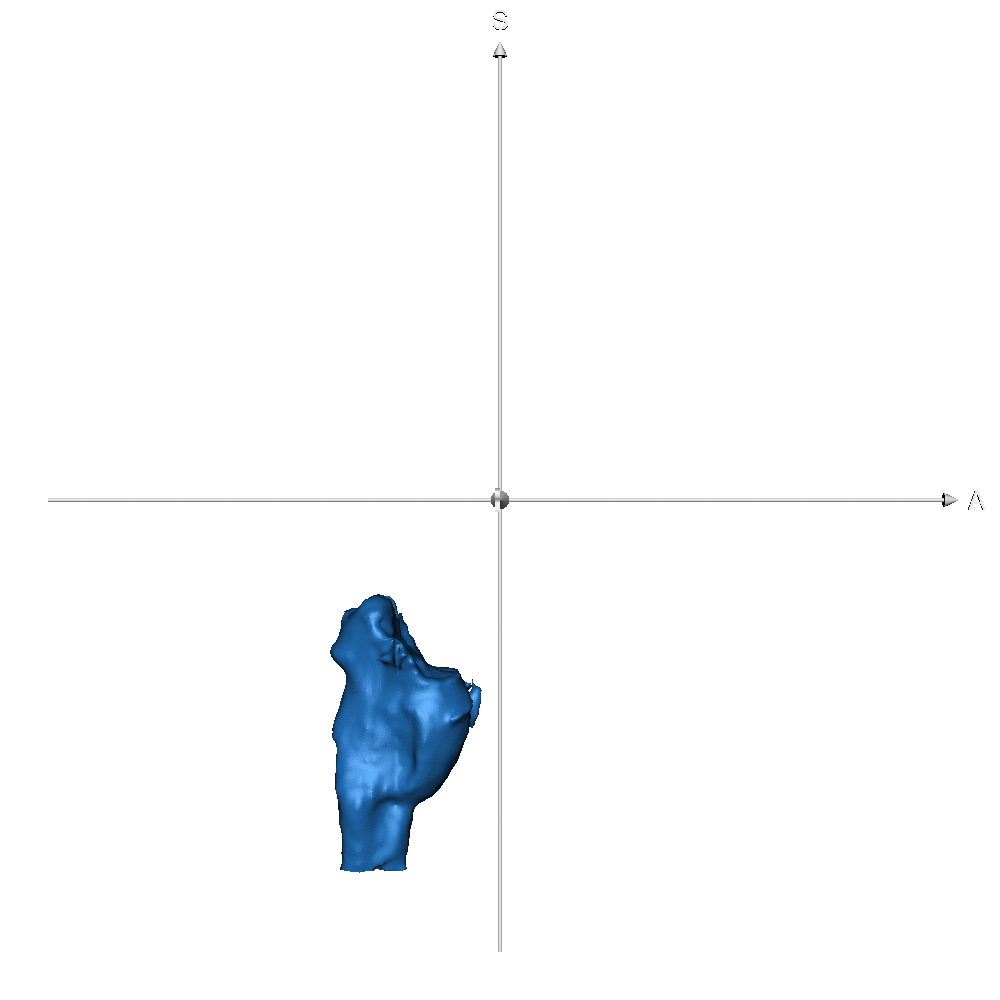
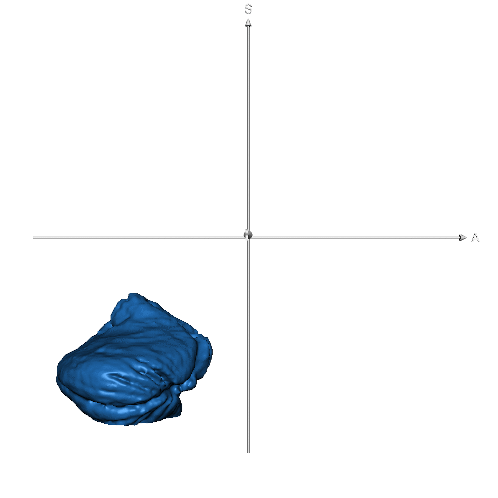

[<-- main page](https://rocknroll87q.github.io/cerebrum7t/)

# Glasgow

### Reconstructed meshes

Below reconstructed meshes of GM, WM, basal ganglia, ventricles, brain stem, and cerebellum of a testing volume, obtained with `CEREBRUM7T` on `sub-055_ses-03`.
A light smoothing operation is performed (50 iterations - BrainVoyager) - **no manual corrections**.

<table align="center" cellspacing="0" cellpadding="0">
<!-- <tr>
 	<td><b style="font-size:20px">Subject</b></td>
 	<td>
<b style="font-size:20px">FreeSurfer v7</b>
</td> 
 	<td>
<b style="font-size:20px">CEREBRUM 7T</b>
</td> 
 </tr>-->
 <tr>
 	<td>
<b>Grey matter</b>
</td> 
 	<td>
<b>White matter</b>
</td> 
 </tr> 

 <tr>
    <td>

</td>
    <td>
  
</td>
 </tr>

 <tr>
 	<td>
<b>Basal ganglia</b>
</td> 
 	<td>
<b>Ventricles</b>
</td> 
 </tr> 

 <tr>
    <td>

</td>
    <td>
  
</td>
 </tr>
 <tr>
 	<td>
<b>Brainstem</b>
</td> 
 	<td>
<b>Cerebellum</b>
</td> 
 </tr> 
 
  <tr>
    <td>

</td>
    <td>
  
</td>
 </tr>
 
</table>

Full meshes created starting from the `CEREBRUM7T` prediction of different testing volumes.

<table align="center" cellspacing="0" cellpadding="0">
<!-- <tr>
 	<td><b style="font-size:20px">Subject</b></td>
 	<td>
<b style="font-size:20px">FreeSurfer v7</b>
</td> 
 	<td>
<b style="font-size:20px">CEREBRUM 7T</b>
</td> 
 </tr>-->
 <tr>
 	<td>
<b>`sub-005_ses-001`</b>
</td> 
 	<td>
<b>`sub-013_ses-001`</b>
</td> 
 	<td>
<b>`sub-019_ses-001`</b>
</td> 
 	<td>
<b>`sub-029_ses-001`</b>
</td> 
 </tr> 

 <tr>
    <td>

</td>
    <td>

</td>
    <td>

</td>
    <td>

</td>
    
 <tr>
 	<td>
<b>`sub-042_ses-001`</b>
</td> 
 	<td>
<b>`sub-058_ses-001`</b>
</td> 
 	<td>
<b>`sub-062_ses-001`</b>
</td> 
 	<td>
<b>`sub-067_ses-001`</b>
</td> 
 </tr> 

 <tr>
    <td>

</td>
    <td>

</td>
    <td>

</td>
    <td>

</td>
    
 </tr>

 <tr>
 	<td></td> 
 	<td>
<b>`sub-069_ses-001`</b>
</td> 
 	<td>
<b>`sub-076_ses-001`</b>
</td> 
 	<td></td> 
 </tr> 

 <tr>
    <td></td>
    <td>

</td>
    <td>

</td>
    <td></td>
    
 </tr>

</table>

### Probability maps

<!--width="256" height="352"-->

